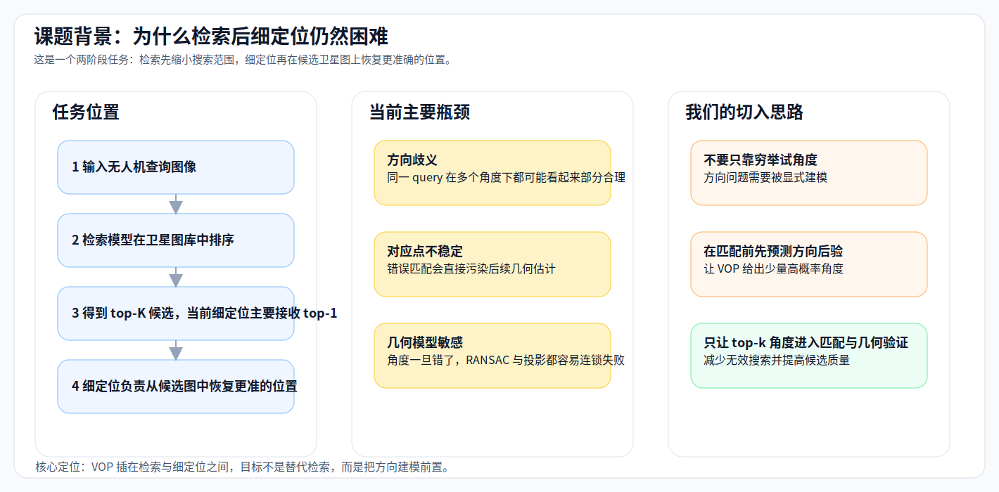
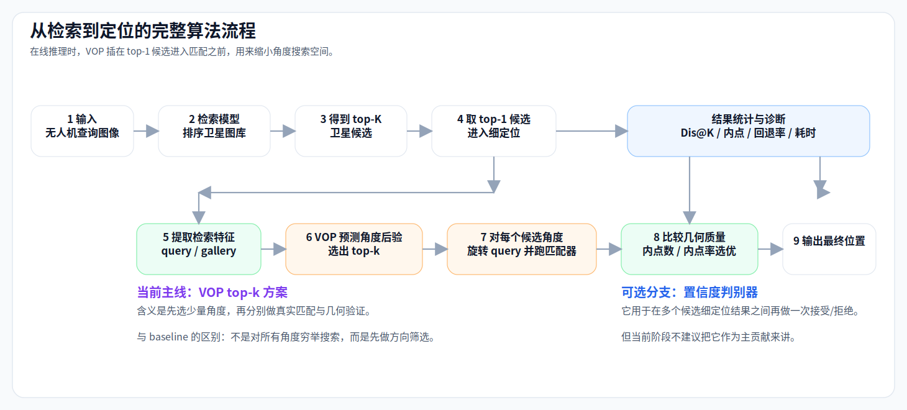
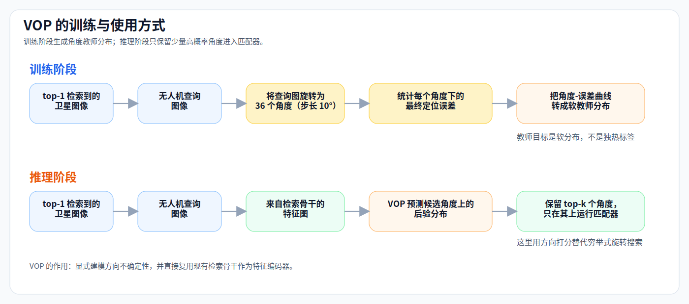
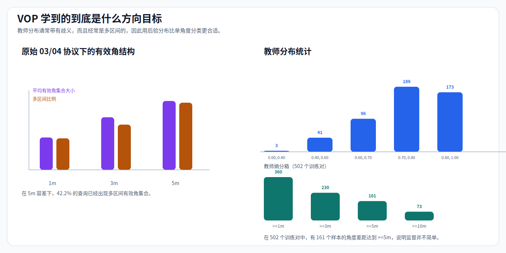
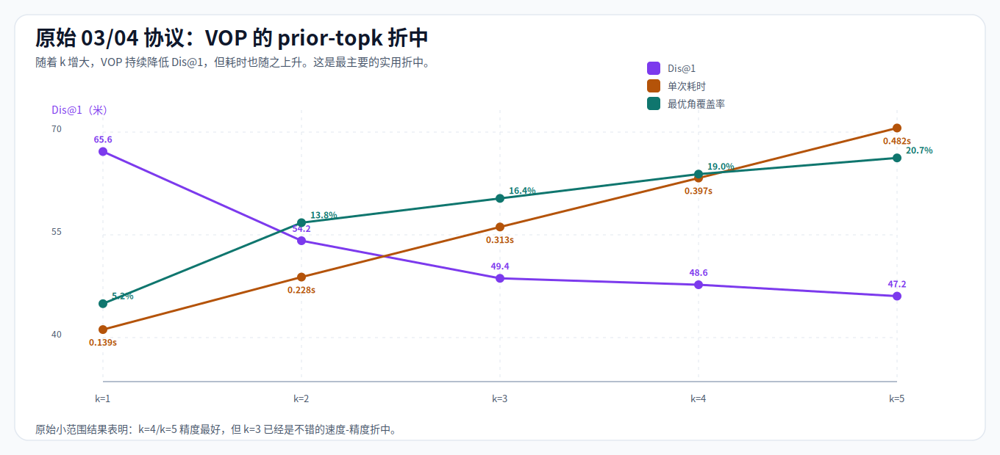
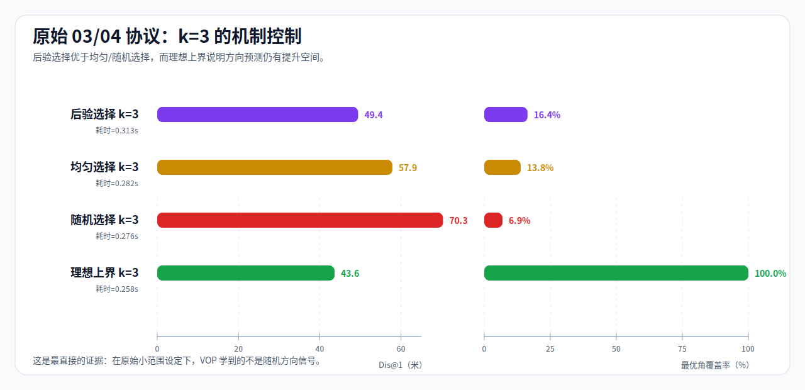
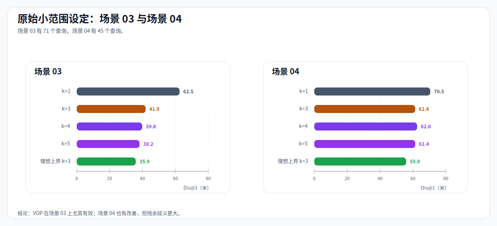
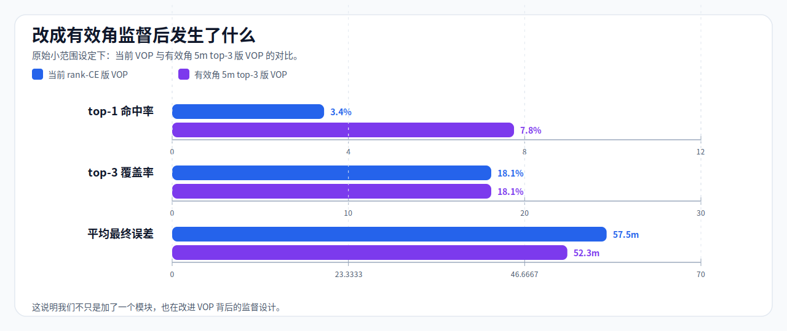
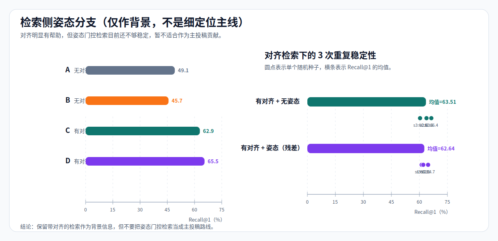
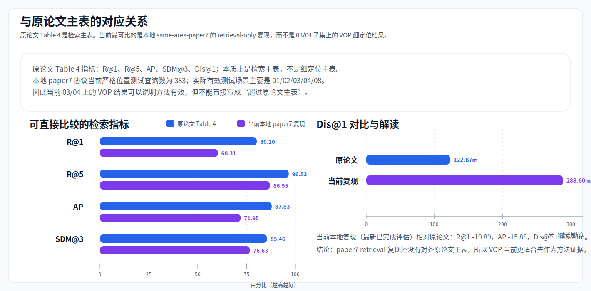

# 2026-04-09 导师汇报材料

## 补充材料
- VOP 训练过程的超详细说明见：[vop_training_deep_dive.md](/home/lcy/Workplace/GTA-UAV/reports/advisor_update_20260409/vop_training_deep_dive.md)

## 题目
VOP 方向后验模块近期进展、完整算法流程与投稿讨论

## 这次汇报想系统讲清楚的内容
- 这项工作在整条“检索 -> 定位”流水线中的位置是什么。
- 当前后检索细定位为什么难，真正的瓶颈在哪里。
- VOP 是什么，我们具体做了什么，它在训练和推理时分别怎么工作。
- 目前 `03/04` 小范围实验已经提供了哪些证据，还缺什么证据。
- 投稿时最适合怎么讲，哪些内容该放主线，哪些只适合当补充。

## 本次建议的汇报主线
- 主线放在 **后检索细定位**，而不是检索训练。
- 主线放在 **VOP 如何显式建模方向**，而不是继续堆穷举式角度搜索。
- 主证据放在 **原始 `03/04` 小范围实验**，因为这部分目前最完整、最稳定。
- `扩展协议` 和更大范围复现继续做，但这次只简要交代，不占主体篇幅。

---

## 1. 课题背景与当前工作位置

当前任务是一个典型的两阶段跨视角地理定位流程：

1. **检索阶段**  
   输入无人机 query 图像，在卫星图库中找到最相似的若干候选。
2. **细定位阶段**  
   在候选卫星图上做更精细的图像匹配与几何估计，输出更准确的位置。

当前这项工作的定位很明确：

- 我们现在主要研究的是 **检索之后的细定位阶段**；
- 不是去改 retrieval backbone；
- 也不是把精力放在检索 Recall 的继续提升上；
- 而是解决“候选图找到了，但最终定位仍然不稳”这个问题。

在当前稳定 VisLoc 评估路径里，细定位主要发生在：

- `D2S` 查询模式下；
- 对检索到的 `top-1 gallery` 图像做进一步定位；
- 当前稳定约定里，如果启用 `--use_yaw`，query UAV 图会按 `-Phi1` 去对齐北向卫星图。



---

## 2. 从检索到定位的完整算法流程

这部分建议在汇报中先讲清楚，因为导师如果先明白模块插入位置，后面 VOP 的意义会更容易理解。

### 2.1 当前完整在线流程

在线推理时，完整流程可以概括成下面 9 步：

1. 输入无人机 query 图像；
2. 用检索模型在卫星图库中计算相似度并排序；
3. 得到 `top-K` 卫星候选；
4. 取 `top-1` 卫星候选进入细定位；
5. 提取 query / gallery 的检索特征；
6. 用 VOP 预测候选角度上的方向后验，选出 `top-k` 个角度；
7. 对每个候选角度，旋转 query，并各跑一次匹配器与几何估计；
8. 比较这些候选结果的几何质量，选择最优结果；
9. 输出最终定位位置，并统计 `Dis@K`、内点、回退率、耗时等指标。

### 2.2 这里 VOP 插在什么位置

VOP 不是直接替代细定位匹配器，也不是替代检索模型。  
它插在：

- `top-1` 检索候选已经确定之后；
- 真正跑匹配器之前；
- 用来先做一次 **方向筛选**。

### 2.3 `top-k=3` 之后到底发生了什么

这是整个方法里最容易被误解的一步，建议在汇报里单独讲一句：

- VOP 先输出概率最高的 `3` 个角度；
- 然后不是直接从这 `3` 个角度里选概率最大的一个结束；
- 而是把 query 分别旋转到这 `3` 个角度；
- 每个角度都各自跑一次真实的匹配器；
- 每个候选角度都会产出一份细定位结果，包括位置、保留匹配数、内点数、内点率等；
- 最后再从这 `3` 份细定位结果里选一个最好的，作为最终输出。

当前 `prior_topk` 主路径里，这个“最好”的判断主要依赖：

- 内点数；
- 如果内点数相同，再比较内点率。

如果额外启用了 `confidence verifier`，它还可以在多候选结果之间再做一次接受 / 拒绝判断；但从当前阶段看，这个分支不适合作为主线来讲。



---

## 3. 当前细定位为什么会不稳

我们目前的判断是：细定位失败的主因，不是“没有候选图”，而是“候选图进来之后，方向与几何这一步不稳定”。

更具体地说，问题主要集中在三点：

### 3.1 方向歧义

- 同一个 query 在多个角度下都可能看起来“局部合理”；
- 如果方向选错，后面的对应点和几何都会被一起带偏；
- 传统 `rotate90` 或更细角度穷举，本质上仍然是在“试角度”，不是在“建模方向”。

### 3.2 对应点质量不稳定

- 稀疏匹配本身对遮挡、视角变化、纹理重复都比较敏感；
- 一旦方向先验不好，错误对应点会显著增多；
- 这些错误对应点会直接污染后面的 RANSAC 与单应估计。

### 3.3 几何估计连锁脆弱

- 角度错了，几何估计通常不会只“差一点”；
- 更常见的是：内点数下降、投影越界、最终落回 coarse center；
- 所以方向问题其实会连锁影响整条细定位路径。

这也是为什么我们现在认为：**最值得做的不是更多角度穷举，而是先把方向建模做得更结构化。**

---

## 4. 我们的解决思路：VOP

`VOP = 视觉方向后验`

它不是：

- 新的匹配器；
- 新的检索骨干；
- 新的几何模型。

它是：

- 一个方向建模模块；
- 输入 `top-1` 卫星图像与无人机 query 图像；
- 输出候选角度上的 **方向后验分布**；
- 再用这个后验去缩小后续匹配器真正要尝试的角度集合。

这条思路的核心改动是：

- 过去：对很多角度都试一遍，然后事后挑；
- 现在：先根据图像内容预测“哪些角度更值得试”，再只让这些角度进入细定位。

从研究表述上看，这条线也更干净：

- 问题：后检索细定位存在方向歧义；
- 原则：方向应该被显式建模，而不只是被穷举；
- 方法：用方向后验指导后续匹配与几何验证；
- 证据：看它是否优于随机 / 均匀控制，以及是否形成稳定的精度-耗时折中。

---

## 5. VOP 的训练与推理是怎么做的

### 5.1 教师信号怎么生成

训练阶段，我们先离线构造方向教师信号：

1. 对每个 `query-top1 gallery` 样本对，枚举 `36` 个旋转角；
2. 每个角度间隔 `10°`；
3. 对每个角度都跑一次后续定位；
4. 记录该角度对应的最终定位误差；
5. 得到一条“角度 -> 最终误差”的曲线；
6. 再把这条曲线转成软教师分布，而不是只留下一个最佳角。

### 5.2 模型怎么学

VOP 本身尽量保持轻量：

- 直接复用检索骨干的特征图；
- 不改 retrieval backbone 的语义；
- 对 gallery 特征与旋转后的 query 特征做交互；
- 输出每个候选角度的分数；
- 再经 softmax 得到方向后验分布。

### 5.3 推理时怎么用

当前实现中，VOP 支持三种接入方式：

- `prior_single`
- `prior_topk`
- `fusion`

这次汇报最值得讲的是 `prior_topk`，因为它最符合“方向筛选”这个方法主线。

### 5.4 为什么 `prior_topk` 是当前最关键的模式

它最直接地体现了我们的核心主张：

- VOP 负责缩小角度搜索空间；
- 匹配器负责真正的细定位；
- 两者职责清楚，不混在一起；
- 既保留了原有定位器的几何解释性，也把方向建模前置了。



---

## 6. 为什么必须学“后验分布”，而不是单角度硬分类

如果方向目标天然就是单峰、尖锐的，那做单角度分类也许就够了。  
但从教师信号统计来看，事实并不是这样。

当前统计结果显示：

- 在 `5m` 容差下，`有效角集合` 的平均大小是 `3.47`；
- `42.24%` 的 query 会出现 **多区间** 有效角集合；
- `161 / 502` 个训练对里，最优角与次优角之间的定位误差差距已经达到 `>=5m`。

这说明方向目标经常具有下面这些性质：

- 它不是单点，而是一个集合；
- 它不是单峰，而可能是多峰；
- 它不是“某个角度绝对对”，而更像“有几个角度都相对合理，但好坏有差别”。

所以：

- 用后验分布去描述方向目标，更符合数据本身的结构；
- 也更适合后面的 `top-k` 候选筛选。



---

## 7. `Posterior / Uniform / Random / Oracle` 分别是什么意思

这部分建议在汇报里单独解释，因为控制实验里这几个词如果不讲清楚，很容易让人听糊涂。

假设一共有 `36` 个候选角度，当前要选 `k=3` 个角度：

### 7.1 `Posterior`

- 按 VOP 预测概率从高到低排序；
- 选概率最高的 `3` 个角度；
- 这是我们真正的方法。

### 7.2 `Uniform`

- 不看 VOP 概率；
- 直接在 `36` 个角度里均匀铺开选 `3` 个；
- 直观上近似于选 `0° / 120° / 240°` 这样覆盖较均匀的组合；
- 它回答的是：“如果只是均匀地多试几个角度，能不能变好？”

### 7.3 `Random`

- 也不看 VOP 概率；
- 从 `36` 个角度里随机抽 `3` 个，且不重复；
- 它回答的是：“如果只是随便多试 `3` 个角度，能不能变好？”

### 7.4 `Oracle`

- 这是理想上界；
- 它直接用真实最终误差来挑最好的 `3` 个角度；
- 实际推理时做不到，只用于说明“如果方向选择做到最好，还能好到什么程度”。

### 7.5 为什么这个控制实验重要

因为我们需要区分两件事：

- 是不是“多试几个角度”本身就会好；
- 还是“VOP 选角度这一步确实有信息量”。

如果 `Posterior` 只是和 `Uniform` / `Random` 差不多，那就说明 VOP 学到的东西不强。  
如果 `Posterior` 明显更好，才说明方向后验这一步有真实价值。

---

## 8. 我们已经把哪些内容真正做出来了

### 8.1 已落地的代码链路

- `Game4Loc/game4loc/orientation/vop.py`
- `Game4Loc/train_vop.py`
- `Game4Loc/build_vop_teacher.py`
- `Game4Loc/analyze_vop.py`
- `Game4Loc/analyze_topk_hypotheses.py`
- `Game4Loc/eval_visloc.py`
- `Game4Loc/game4loc/evaluate/visloc.py`

### 8.2 已打通的实验链

- 教师缓存构建；
- VOP 训练；
- `prior_single / prior_topk` 接入细定位评估；
- `Posterior / Uniform / Random / Oracle` 控制实验；
- 有效角监督版本对比；
- 检索侧姿态分支的配套尝试。

### 8.3 这意味着什么

现在 VOP 已经不是一个停留在概念上的想法，而是一条能重复跑通的研究链路：

- 有训练数据构造；
- 有模型训练；
- 有推理接入；
- 有机制验证；
- 有错误分析与后续改进空间。

---

## 9. `03/04` 小范围上的主结果：VOP 确实在持续起作用

原始 `03/04` 小范围设定下，`prior-topk` 的总体趋势很清楚：

- `k=1`：`Dis@1 = 65.64m`
- `k=2`：`54.25m`
- `k=3`：`49.44m`
- `k=4`：`48.63m`
- `k=5`：`47.17m`

这说明：

- VOP 不是只在某一个点上偶然有效；
- 随着 `k` 增大，效果在持续改善；
- 也就是说，VOP 学到的方向信息确实在帮助细定位。

### 9.1 与耗时的关系

耗时也会同步上升：

- `k=1`：`0.139s/query`
- `k=3`：`0.313s/query`
- `k=5`：`0.482s/query`

如果看与常见 baseline 的对比：

- `no_rotate`：`0.094s/query`
- `rotate90`：`0.292s/query`
- `prior_single`：`0.123s/query`
- `prior_topk3`：`0.276s/query`
- `prior_topk4`：`0.352s/query`
- `prior_topk5`：`0.403s/query`

更准确的结论是：

- 相对 `no_rotate`，VOP 没有时间优势；
- 相对 `rotate90`，`prior_single` 明显更快，`prior_topk3` 大致同量级；
- 如果把 `k` 开到 `4/5` 去追精度，时间优势会变弱甚至消失。

所以当前最像工程平衡点的是：

- `prior_topk2`
- 或 `prior_topk3`



---

## 10. 机制控制：为什么说 VOP 学到的不是随机信号

在 `k=3` 的控制实验中：

- `后验选择 k=3`：`Dis@1 = 49.44m`
- `均匀选择 k=3`：`57.87m`
- `随机选择 k=3`：`58.31m`
- `理想上界 k=3`：`43.64m`

对应最优角覆盖率：

- `后验选择 k=3`：`16.38%`
- `均匀选择 k=3`：`13.79%`
- `随机选择 k=3`：`8.49%`
- `理想上界 k=3`：`100%`

这里最关键的解释是：

- 如果只是“多试 3 个角度”，`Uniform` 和 `Random` 也应该差不多能提升；
- 但现在 `Posterior` 明显好于 `Uniform / Random`；
- 所以提升不只是因为“多试了几个角度”；
- 而是因为 **VOP 选角度这一步本身有信息量**。

同时，`Posterior` 与 `Oracle` 之间还有明显差距，这说明：

- 方向信息还没有学满；
- 方向预测本身仍是可以继续加强的部分。



---

## 11. 分场景结果：当前收益主要集中在哪些地方

原始小范围协议里：

- 场景 03：`71` 个查询
- 场景 04：`45` 个查询

### 11.1 场景 03

- `k=1`：`62.54m`
- `k=3`：`41.89m`
- `k=4`：`39.80m`
- `k=5`：`38.15m`

### 11.2 场景 04

- `k=1`：`70.53m`
- `k=3`：`61.36m`
- `k=4`：`62.56m`
- `k=5`：`61.40m`

这说明：

- VOP 在场景 03 上证据很强；
- 场景 04 也有改善，但幅度明显更小；
- 因而当前最合理的解释不是“方向问题已经解决”，而是“方向确实是瓶颈之一，但不是唯一瓶颈”。



---

## 12. 我们还改了 VOP 的监督设计

当前做过一个很关键的变化：

- 从较直接的 `rank-CE` 版本；
- 换到基于 `有效角集合` 的监督版本。

带来的变化：

- top-1 命中率：`3.4% -> 7.8%`
- top-3 覆盖率：`18.1% -> 18.1%` 基本持平
- 平均最终误差：`57.5m -> 52.3m`

这说明：

- 我们不只是“加了一个模块”；
- 也在开始改进 VOP 的训练目标；
- 监督设计确实会影响后验质量。

但也要诚实地说：

- 当前 top-3 覆盖率仍然不高；
- 所以 VOP 还远没到“方向问题已经被彻底解决”的阶段。



---

## 13. 检索侧之前也做过哪些尝试

虽然这次汇报主角是 VOP，但检索侧我们也做过系统尝试。

### 13.1 做过什么

- `A/B/C/D` 四组：
  - `A: 无对齐 + 无姿态`
  - `B: 无对齐 + 有姿态`
  - `C: 有对齐 + 无姿态`
  - `D: 有对齐 + 有姿态`
- 后续又做了：
  - `3 次随机种子` 重复实验；
  - `残差门控 / 乘性门控` 对比。

### 13.2 当前结论

- `对齐` 明显有帮助；
- `姿态门控` 自身不稳定；
- 因而检索侧姿态分支目前不适合当主投稿贡献。

换句话说，它更像：

- 一条做过、但目前证据还不够强的支线；
- 可以在汇报里简要交代；
- 但不应该抢 VOP 主线的位置。



---

## 14. 和原论文主表中的数据怎么对比

这部分建议在汇报里单独交代清楚，否则很容易出现“拿子集细定位结果去对原论文检索主表”的不严谨比较。

### 14.1 原论文主表本质上是什么

根据本地 `paper7` 协议复现说明，原论文 `Table 4` 在 UAV-VisLoc 上主要对应的是 **retrieval-only 主表**，关键指标是：

- `R@1 = 80.20`
- `R@5 = 96.53`
- `AP = 87.83`
- `SDM@3 = 85.46`
- `Dis@1 = 122.87m`

这些数值本质上是在回答：

- 检索是否把正确候选排到了前面；
- 粗定位误差是否已经足够小。

它不是当前这套 `with_match` 后检索细定位的主表。

### 14.2 当前本地最可比的复现进度

当前本地最可比的是：

- `same-area-paper7` 协议；
- `test_pos_queries = 383`；
- retrieval-only 评估；
- 最新日志里 **已完成的一轮评估**（当前看到的是 epoch 9）。

这一轮的指标是：

- `R@1 = 60.31`
- `R@5 = 86.95`
- `AP = 71.95`
- `SDM@3 = 76.63`
- `Dis@1 = 288.60m`

和原论文目标相比，目前仍有明显差距：

- `R@1` 差 `-19.89`
- `R@5` 差 `-9.58`
- `AP` 差 `-15.88`
- `SDM@3` 差 `-8.83`
- `Dis@1` 多 `165.73m`

### 14.3 这对当前 VOP 汇报意味着什么

这意味着现在最稳妥的说法应该是：

- 当前 `03/04` 上的 VOP 结果，能证明 **方法在后检索细定位上是有效的**；
- 但它们还不能直接写成“已经超过原论文主表”；
- 因为原论文主表和当前 `03/04` 细定位实验，不在同一个协议层面。

更准确地说：

- **原论文主表** 对应的是 `paper7` 风格的 retrieval-only 对齐目标；
- **当前 VOP 主结果** 对应的是 `03/04` 子集上的 post-retrieval fine localization 方法证据。

所以当前最合适的策略是：

- 一边继续推进 `paper7` 协议上的 retrieval reproduction；
- 一边把 VOP 在 `03/04` 上的机制证据讲清楚；
- 不把这两件事混成一个“已经全面超过原论文”的结论。



---

## 15. 当前最准确的判断

### 15.1 现在可以比较肯定地说

- VOP 这条方向是成立的；
- 它不是随机有效；
- 在原始 `03/04` 小范围设定上，证据已经比较完整；
- 它比单纯的穷举式角度搜索更像一个结构化方法。

### 15.2 现在还不能过度声称

- 还不能说 VOP 已经稳定替代所有方向搜索；
- 还不能说它在更大范围协议上已经形成强而稳定的提升；
- 还不能把 confidence verifier 一起打包成成熟主方法；
- 还不能把检索侧姿态分支当成主投稿贡献。

### 15.3 更准确的表述

当前 VOP 已经具备 **可写论文原型** 的雏形，但如果想把投稿做得更强，最好再补一个结构化组件，例如：

- `姿态条件匹配过滤`
- 或 `单应性之前的低自由度几何模型`

---

## 16. 当前阶段最适合怎么讲投稿

### 16.1 如果现在就准备一版投稿

更适合讲成：

- 问题：后检索细定位中的方向歧义；
- 方法：视觉方向后验 VOP；
- 机制：先做方向筛选，再做匹配与几何验证；
- 证据：在 `03/04` 小范围上优于穷举式基线，也优于随机 / 均匀控制。

### 16.2 如果再做一轮再投

更推荐补：

- `方向打分 + 姿态条件匹配`
- 而不是继续堆更多角度启发式

### 16.3 我现在的倾向

- 先把 VOP 这条线讲清楚并稳住；
- 再决定是先投短文，还是补一轮方法后做更正式投稿。

---

## 17. 这次建议和导师重点讨论的问题

- VOP 是否作为后续汇报与论文写作的主线？
- 投稿是否先聚焦 `03/04` 小范围结果，还是必须等更大范围复现稳定后再写？
- 检索侧姿态分支是否降级为补充实验，不再占主文主线？
- VOP 下一步优先补 `姿态条件过滤` 还是 `低自由度几何模型`？

---

## 可复现材料

- 汇报文档：
  - `reports/advisor_update_20260409/advisor_update_20260409.md`
- 幻灯片版：
  - `reports/advisor_update_20260409/advisor_update_20260409_slides.md`
- 图表生成：

```bash
python3 reports/advisor_update_20260409/build_assets.py
```

- 主要数据来源：
  - `Game4Loc/work_dir/vop/topk_analysis/summary_compact_0408.json`
  - `Game4Loc/work_dir/vop/diagnostics_0407_full_rankce_current.json`
  - `Game4Loc/work_dir/vop/diagnostics_0408_useful5_top3.json`
  - `Game4Loc/work_dir/vop/topk_analysis/cache_same_area_full.json`
  - `Game4Loc/work_dir/vop/topk_analysis/phaseA_official_main_table_0408.json`
  - `Game4Loc/work_dir/visloc_pose_abcd_large_20260403_195252/summary.txt`
  - `Game4Loc/work_dir/visloc_pose_cd_main_20260404_011657/summary.txt`
